# 搜索引擎项目

**要求：必须使用 CMake 来管理项目！**

## 第一期 离线部分

### 关键字推荐

#### 需求

根据语料库和停用词生成 **词典库** 和 **索引库**。

英文：

- 打开目录，读取语料文件 (目录流：`opendir()`, `closedir()`, `readdir()`)。
- 分词：去掉数字和标点符号，只保留字母；将字母统一转换成小写；按空白字符分割。  

- 过滤掉停用词。
- 统计每一个单词 (Token) 的出现的频率。
- 生成词典库和索引库。

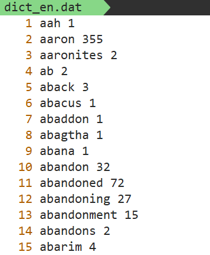 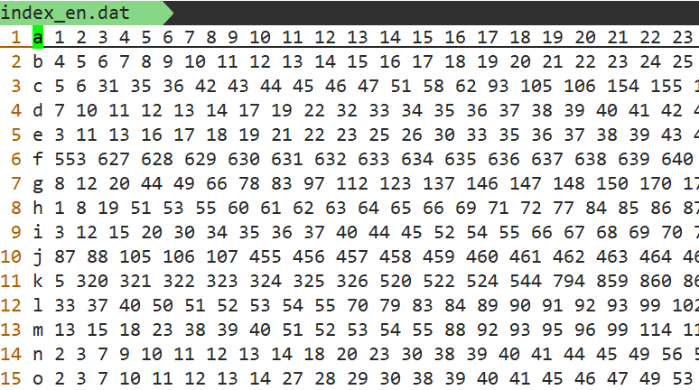

中文：

- 打开目录，读取语料文件 (目录流：`opendir()`, `closedir()`, `readdir()`)。
- 使用 cppjieba 分词。  

- 过滤掉停用词。
- 统计每一个单词 (Token) 的出现的频率。
- 生成词典库和索引库 (需要使用 utfcpp 库分割出一个一个汉字)。

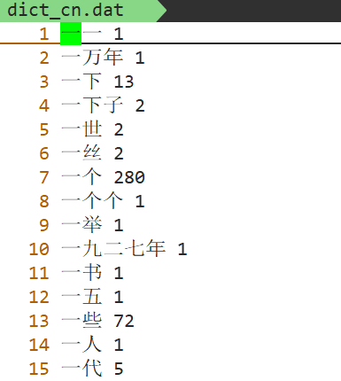 

#### 设计

```c++
// DirectoryScanner.h
#pragma once
#include <vector>
#include <string>

class DirectoryScanner
{
public:
    /**
     * 遍历目录 dir, 获取目录里面的所有文件名
     */ 
    static std::vector<std::string> scan(const std::string& dir);

private:
    DirectoryScanner() = delete;
};
```

```c++
// KeywordProcessor.h
#pragma once
#include <cppjieba/Jieba.hpp>
#include <string>
#include <set>

class KeyWordProcessor {
public:
    KeyWordProcessor();
	
    // chDir: 中文语料库
    // enDir: 英文语料库
    void process(const std::string& chDir, const std::string& enDir);

private:
    void create_cn_dict(const std::string& dir, const std::string& outfile);
    void build_cn_index(const std::string& dict, const std::string& index);

    void create_en_dict(const std::string& dir, const std::string& outfile);
    void build_en_index(const std::string& dict, const std::string& index);
private:
    cppjieba::Jieba m_tokenizer;
    std::set<std::string> m_enStopWords;
    std::set<std::string> m_chStopWords;
};
```

#### cppjieba 库

**安装**

cppjieba 是一个 header-only 的库，我们需要将对应的文件放到 `/usr/local/include`  目录下，然后在将 `dict` 目录移动到 `/usr/local` 目录下：

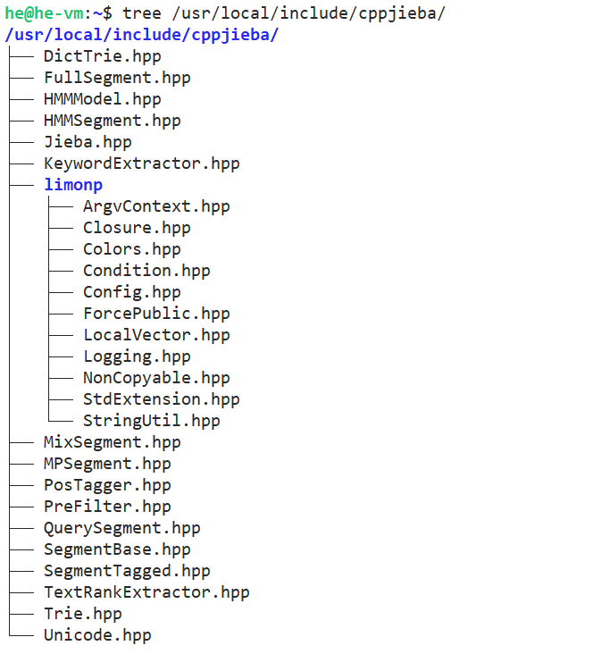 

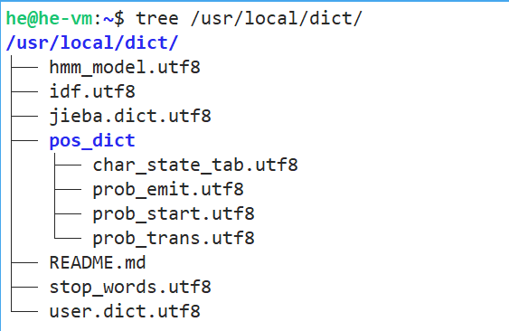 

**使用**

cppjieba 有多种分词方式，其中最重要的有三种方式：MP (Maximum Probability 最大概率分词)，HMM (Hidden Markov Model 隐马模型分词)，Mix (混合模式：默认方式)。它们的区别如下：

| 模式 |             方法              |                            特性                             |
| :--: | :---------------------------: | :---------------------------------------------------------: |
|  MP  | `Cut(sentence, words, false)` | 基于前缀词典构建词图，使用动态规划找最大概率路径 (精确分词) |
| HMM  |   `CutHMM(sentence, words)`   |                 基于隐马模型，适合新词识别                  |
| Mix  |    `Cut(sentence, words)`     |         先 MP 分词，再用 HMM 识别 MP 无法识别的新词         |

接下来，我们写一个的示例，演示一下这三种分词方法的区别：

```c++
// exampe01.cc
#include <iostream>
#include "cppjieba/Jieba.hpp"

void print_words(const std::string& title, const std::vector<std::string>& words)
{
    std::cout << "[" << title << "] ";
    for (const auto& w : words) {
        std::cout << w << "/ ";
    }
    std::cout << std::endl;
}

int main()
{
    // 创建Jieba对象会读取配置文件，所以比较耗时
    // 最佳实践: 最好只创建一个Jieba对象
    cppjieba::Jieba tokenizer;

    std::string s = "金胖胖是一名杰出的计算机科学家，他来到了今天武汉天源迪科，让我们热烈欢迎金胖胖同学！";
    std::vector<std::string> words;

    // [MP]
    tokenizer.Cut(s, words, false); // HMM = false
    print_words("MP", words);

    // [HMM]
    tokenizer.CutHMM(s, words);
    print_words("HMM", words);
    
    // [MIX]
    // tokenizer.Cut(s, words, true);  // HMM = true
    tokenizer.Cut(s, words);
    print_words("MIX", words);
}
```

#### utfcpp 库

**安装**

utfcpp 也是一个 header-only 的库，我们只需要将对应的文件放到 `/usr/local/include`  目录下即可：

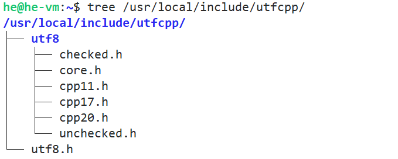 

**使用**

```c++
// example01.cc
// 	 打印每一个汉字的Unicode码点(Unicode codepoint)
#include <iostream>
#include "utfcpp/utf8.h"

int main()
{
    std::string s = "你好，世界！!";
    
    auto it = utf8::iterator{ s.begin(), s.begin(), s.end() };
    auto end = utf8::iterator{ s.end(), s.begin(), s.end()  };

    for (; it != end; ++it) {
        char32_t codepoint = *it;
        std::cout << "U+" << std::hex << codepoint << "\n";
    }
}
```

```c++
// example02.cc
//   打印一个一个汉字
#include <iostream>
#include "utfcpp/utf8.h"

int main()
{
    std::string s = "你好，世界！!";
    
    const char* it = s.c_str();
    const char* end = s.c_str() + s.size();

    while (it != end) {
        auto start = it;
        utf8::next(it, end);    // 将it移动到下一个utf8字符所在的位置
        // 因为一个汉字需要占用多个字节,我们可以用std::string来表示一个汉字
        std::string alpha = std::string{ start, it };
        std::cout << alpha << "\n";
    }
}
```

### 网页搜索

#### 需求

我们要根据给定的语料 (在公司中，往往是爬取下来的网页，或者是公司内部的文档)，生成 **网页库**、**网页偏移库** 和 **倒排索引库**。

**网页库** 的格式如下所示：包含 < doc \>, < id \>, < link \>, < title \>, < content \> 等标签。

 

**网页偏移库** 的目的是 **快速地定位文档**，它个格式是: < 文档 id \>  < 偏移量 \> < 文档大小 \>

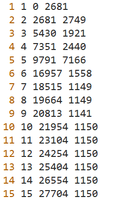 

**倒排索引库** 是搜索引擎很核心的一个数据结构，它的格式如下：< 关键字 \> < 文档 id \> < 关键字在文档中的权重 \> [< 文档 id \> < 关键字在文档中的权重 \> ]…

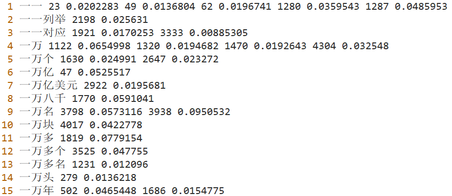 

#### 流程

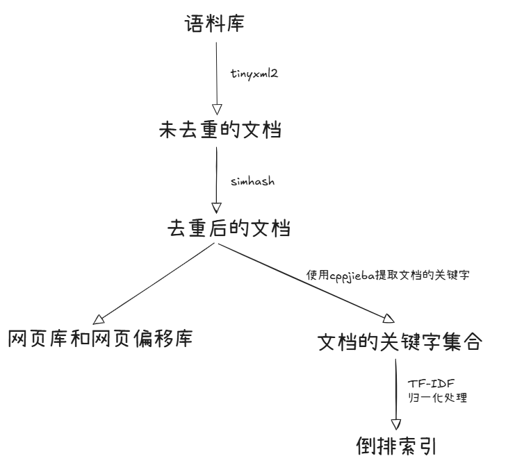

- 使用 `tinyxml2` 提取语料库中的文档
  - 我们要为 xml 文件中每一个 < item \> 标签生成一个 < doc \>
  - 如果 < item \> 中有 < content \>，将 < content \> 标签中的内容作为 < doc \> 的 < content \> 的内容；如果 < item \> 中没有 < content \> 标签，那么将 < description \> 标签中的内容作为 < doc \> 的 < content \> 内容；如果 < item \> 中也没有 < description \> 标签，那么忽略该 < item \>。
- 使用 `simhash` 库对文档去重。
  - 计算每篇文档的 `simhash` 值，根据汉明距离对文档去重 (我们认为汉明距离在 3 以内的文档，内容是十分相似的)。
- 根据去重后的文档，生成网页库和网页偏移库。
- 使用 cppjieba 提取去重后文档中的关键字。
- 使用 `TF-IDF` 算法计算关键字在文档中的权重，对关键字的权重进行归一化处理。
- 生成倒排索引库。

#### 设计

```c++
// DirectoryScanner.h
#pragma once
#include <vector>
#include <string>

class DirectoryScanner
{
public:
    static std::vector<std::string> scan(const std::string& dir);

private:
    DirectoryScanner() = delete;
};
```

```c++
// PageProcessor.h
#pragma once
#include <string>
#include <vector>
#include <set>

#include "cppjieba/Jieba.hpp"
#include "simhash/Simhasher.hpp"

class PageProcessor
{
public:
    PageProcessor();
    void process(const std::string& dir);

private:
    void extract_documents(const std::string& dir);
    void deduplicate_documents();
    void build_pages_and_offsets(const std::string& pages, const std::string& offsets);
    void build_inverted_index(const std::string& filename);
private:
    struct Document 
    {
        int id;
        std::string link;
        std::string title;
        std::string content;
    };

private:
    cppjieba::Jieba m_tokenizer;
    simhash::Simhasher m_hasher;
    std::set<std::string> m_stopWords;    // 使用set, 而非vector, 是为了方便查找
    std::vector<Document> m_documents;    
    std::map<std::string, std::map<int, double>> m_invertedIndex;
};
```

#### simhash 库

**安装**

simhash 库和 cppjieba 库是同一个作者写的，我们只需要将对应的头文件拷贝到 `/usr/local/include` 目录下即可。

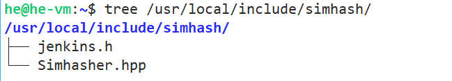  

**示例**

```c++
/**
 * example01.cc 
 *   提取特征，生成simhash值
 */ 
#include <iostream>
#include <fstream>
#include "simhash/Simhasher.hpp"

using namespace simhash;

int main(int argc, char** argv)
{
    Simhasher simhasher;
    string content = "我是蓝翔技工拖拉机学院手扶拖拉机专业的。不用多久，我就会升职加薪，当上总经理，出任CEO，走上人生巅峰。";
    
    // 提取特征 
    size_t topN = 5;
    vector<pair<string ,double>> features;
    simhasher.extract(content, features, topN);
    for (const auto& [feature, weight] : features) { 
    	cout << feature << ": " << weight << "\n";
    }

    // 生成simhash值
    uint64_t hashcode;
    simhasher.make(content, topN, hashcode); 
    cout<< "simhash值是: " << hashcode <<endl;
    string s;
    Simhasher::toBinaryString(hashcode, s);
    cout << "二进制序列: " << s << "\n";
}
```

#### TF-IDF 算法

该算法会涉及到如下几个概念：

**TF (Term Frequency)**: 词语在文档中出现的频率。

**DF (Document Frequency)**: 包含词语的文档个数。

**IDF (Inverse Document Frequency)**：逆文档频率，其计算公式为 $\text{IDF}=log_2(\text{N}/\text{DF})$ ，其中 N 表示文档的总数。

理解这些概念之后，我们就可以计算关键字的 TF-IDF 权重了：$$w= \text{TF} * \text{IDF}$$。可以看出，关键字的权重与它在文档中出现的次数成正比，和包含该关键字的文档个数成反比。

一篇文档很可能会包含多个关键字，首先我们要计算每个关键字的 TF-IDF 权重：$w_1, w_2,\dots,w_n$，然后对这些权重进行归一化处理:

​												$w' = w \div \sqrt{w_1^2 + w_2^2 + \dots +w_n^2}$

倒排索引中保存是归一化后的权重，即 $w'$。


## 第二期：在线部分

### 2.1 服务端框架

服务器端框架的选择有两种：① Reactor ② wfrest

我们建议大家使用 Reactor 框架，原因有两点：

1. 可以帮助大家复习前面 Reactor 的知识点。由于 Linux 还没有真正 (内核级别) 的异步 I/O，所以，目前 Linux 平台几乎所有的高性能网络框架都是基于 Reactor 模型和 `epoll` 的。
2. 可以达到更好的锻炼效果。自己从 0 实现一个 WebServer，有助于大家锻炼自己的编码水平 ，也有助于帮助大家理解网络框架的底层原理。

服务器端整体框架如下所示 (仅供参考)：

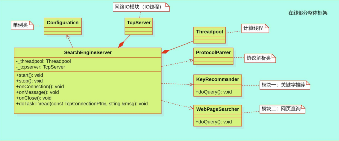

由于 Reactor 是基于 TCP 的。我们需要自定义协议来解决 TCP 的粘包和半包问题，一般我们会采用 TLV 协议：

```cpp
struct Message {
    int tag;	// 消息的类型 	1: 关键字推荐 2: 网页搜索
    int length;	// value的长度
    std::string value;	//消息的内容
};
```


### 2.2 关键字推荐

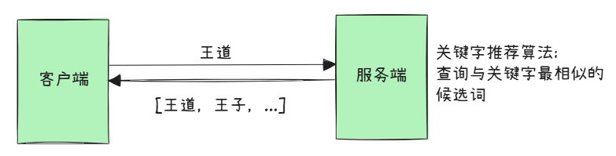

服务器获取客户端传过来的关键字后，会根据 **索引库** 和 **词典库**，选取与关键字最相近的一些候选词，并将其返回给客户端。

**候选词的选取**

1. 将关键字拆分成一个一个字符。
2. 通过索引库获取每一个字符对应的词语集合，合并所有的词语集合，得到候选词集合。
3. 通过 **编辑距离** 算法，计算候选词集合中的候选词与关键字的相似度。
4. 选择最相近的候选词：
   - 优先比较编辑距离
   - 在编辑距离相同的情况下，比较候选词的词频；优先选择词频高的候选词。
   - 在词频相同的情况下，按字典序比较候选词的大小；优先选择小的候选词。
5. 选择最相近的 k (例如：3 个或 5 个) 个候选词，以 JSON 格式返回给客户端。(提示：可以使用优先队列 `priority_queue`)

### 2.3 网页搜索

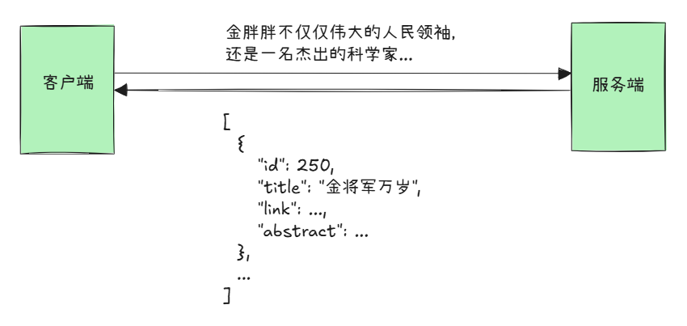

服务器获取客户端输入的查询内容，会根据 **倒排索引库**、**网页库 ** 和 **网页偏移库** 选取与查询内容最相关的一些网页，并根据网页内容 (\< content \> 标签中的内容) 生成摘要 (abstract)，返回给客户端。

**网页的选取**

1. 核心处理：将用户输入的查询内容视为一篇新的 **文档 X**。  
   - 使用 cppjieba 对文档 X 进行分词，过滤停用词，获取关键字集合。
   - 使用 TF-IDF 算法计算出每个关键字的权重，将其组成一个向量 $X = (x_1,x_2,\dots,x_n)$，我们称该向量为 Base (基准向量)。
2. 通过倒排索引库，查询包含所有关键字的网页。当网页库很大的情况下，我们几乎总是可以找到这样的网页的；如果没有包含所有关键字的网页，我们就返回空数组。
3. 如果找到了包含所有关键字的网页，我们则采用 **余弦相似度** 算法对网页进行排序。
   - 既然网页包含所有的关键字，那么我们就可以通过倒排索引库获取每一个关键字的权重，将其组成向量 $Y=(y_1,y_2,\dots,y_n)$。
   - 计算基准向量 $X$ 与 $Y$ 的余弦值，该余弦值就代表了 $X$ 与 $Y$ 的相似度。
   - 根据余弦值对网页进行排序，余弦值越大越相似，网页也就越靠前。

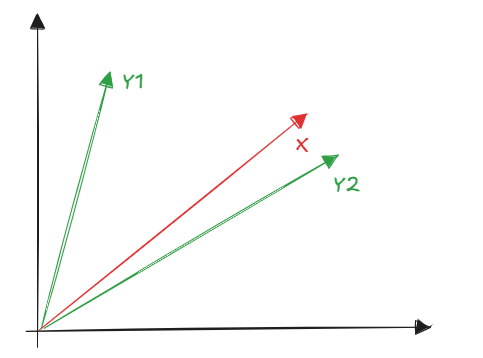
$$
cos\theta = \frac{X\cdot Y}{|X||Y|} \newline
X\cdot Y = x_1y_1 + x_2y_2 + \dots + x_ny_n
$$

4. 找到网页之后，我们需要提取每篇网页中的 id, title, link 信息，并根据网页内容生成摘要 (abstract)。将这些信息封装到 JSON 中，返回给客户端。生成摘要有两种方式：
   - 静态摘要：将文档的内容的前 n 个字符作为摘要，比如前 50 个字符。  
   - 动态摘要：将查询关键字附近的文字组成摘要。


## 第三期：缓存设计

我们可以使用缓存来加快查询结果。在我们这个项目中，缓存有三种设计方案：

- 直接使用 Redis 
- 自己设计缓存 (比如 `LRUCache`)
- `LRUCache` 作为一级缓存，Redis 作为二级缓存。(`LRUCache` 在进程内部，速度会比 `Redis` 快一个数量级)

### 3.1 LRUCache

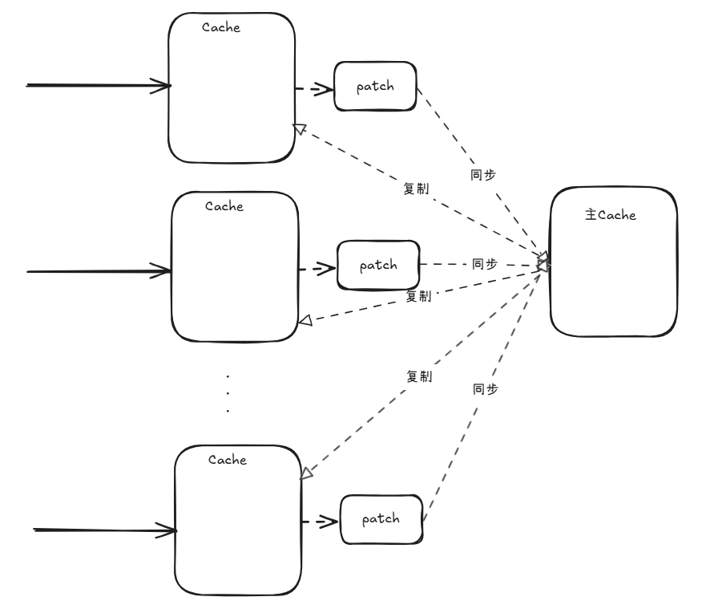

**Case 1: 缓存命中**

1. 查询 `LRUCache`，命中
2. 将查询结果返回给客户端

**Case 2:  缓存未命中**

1. 查询 `LRUCache`，未命中
2. 查库 (文件或数据库)，计算结果
3. 将计算结果放入 cache
4. 将计算结果放入 patch

**Case 3: 缓存同步 (定时任务)**

1. 将各个线程的 patch 添加到主缓存
2. 将主缓存的数据复制到各个线程的 cache

要让每个线程都有自己的 cache 和 patch，我们可以定义如下结构 (仅供参考)：

```cpp
struct ThreadResource
{
    int id;			// 用户自定义的线程 id
    LRUCache cache;	// LRUCache里面会有互斥锁，同步的时候需要获取该互斥锁
    LRUCache patch;
    ...
};
```
